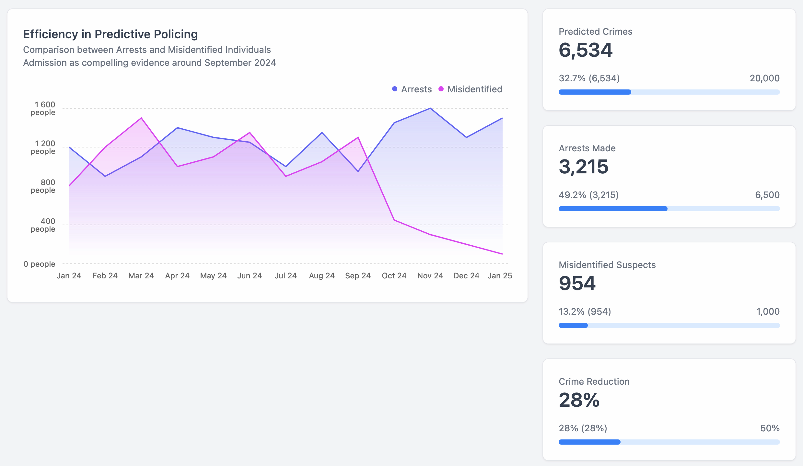

# SAIProject

Welcome to the next-generation core repository for Society-AI's Predictive Policing model.

## Introduction

This model leverages state-of-the-art neural networks, NLP techniques, and ensemble methods to provide unparalleled accuracy in predictive policing.

## Directory Structure

- data/
  - raw_data/
    - crime_data.csv
- model/
  - neural_network/
    - network_architecture.json
    - train_nn.py
  - ensemble/
    - train_ensemble.py
  - predict.py
- utils/
  - preprocessing/
    - normalization.py
    - tokenization.py